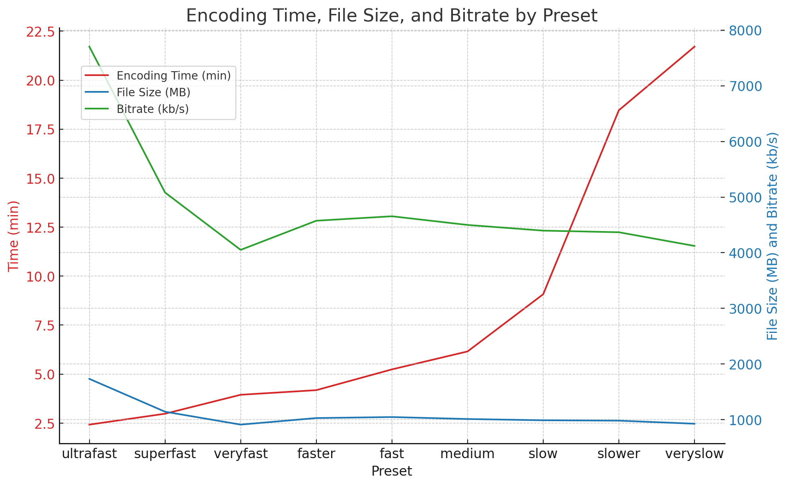

This script takes the specified video, time, and duration and encodes that
video at that time for that duration across all of ffmpeg's various settings,
recording how long it took in the log. These can then be combined with
retrieving the bitrate through

```sh
for preset in ultrafast superfast veryfast faster fast medium slow slower veryslow; do echo "$preset:"; ffmpeg -i "output_${preset}.mp4" -hide_banner 2>&1 | grep "bitrate:"; done
```

and passed to ChatGPT to produce a table and chart, examples of which follows:

| Preset    |   Time (min) |   Bitrate (kb/s) |   File Size (MB) |
|:----------|-------------:|-----------------:|-----------------:|
| ultrafast |      2.41983 |             7702 |         1733.1   |
| superfast |      2.97605 |             5082 |         1143.52  |
| veryfast  |      3.94317 |             4051 |          911.64  |
| faster    |      4.17835 |             4575 |         1029.53  |
| fast      |      5.23873 |             4655 |         1047.6   |
| medium    |      6.15433 |             4499 |         1012.33  |
| slow      |      9.07438 |             4397 |          989.445 |
| slower    |     18.4625  |             4368 |          982.876 |
| veryslow  |     21.7079  |             4122 |          927.628 |



This is not really a general-purpose benchmark, particularly reusable,
particularly reconfigurable, or designed to be used without a LLM capable
of taking natural language text and reinterpreting it as code to create a
table and chart.

I'm really just pushing this to make sure I have it if I ever need it again.
If I were to use this again, I'd probably have ChatGPT rewrite it in Python and
store the data in JSON, including the bitrate, so that there was one script that
did everything and worked on all platforms.
